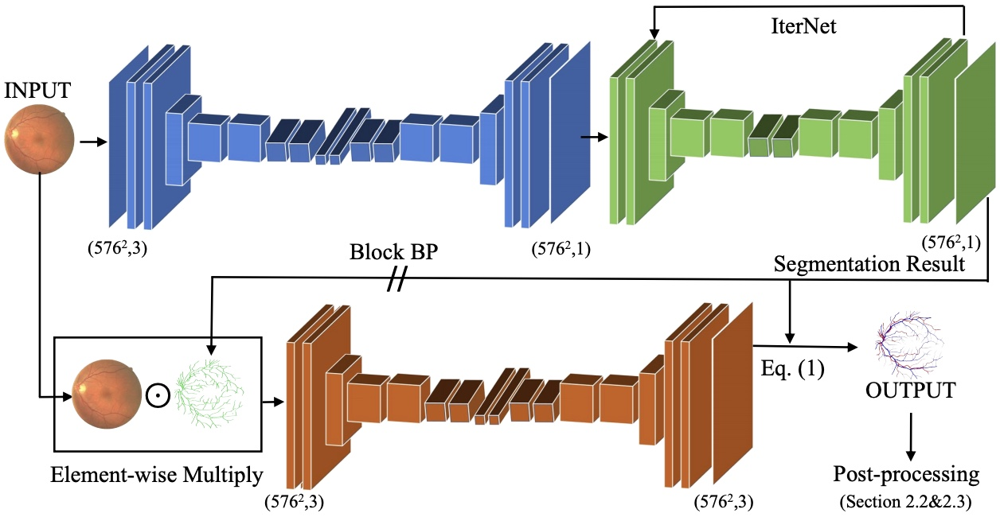
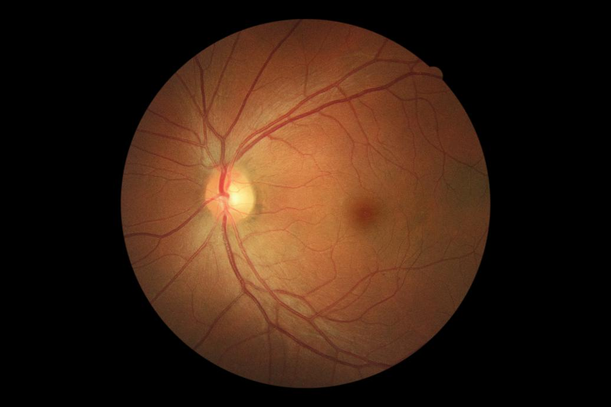
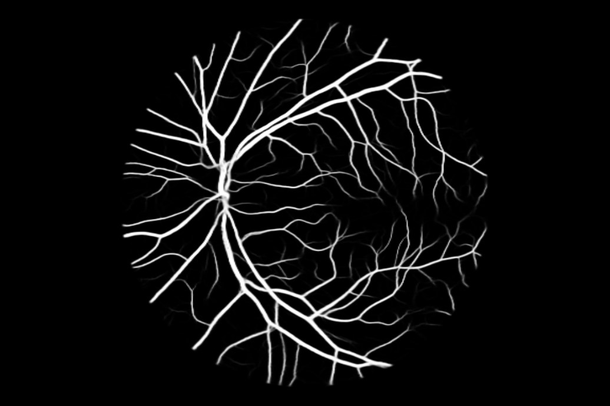
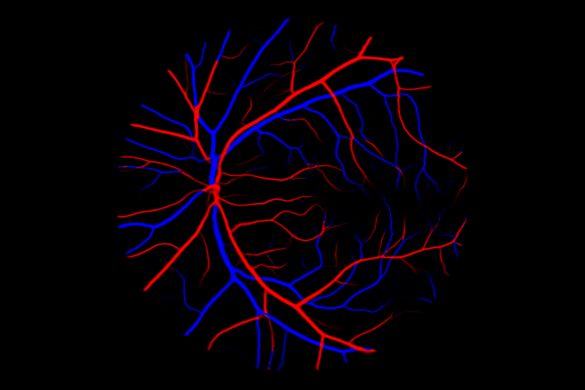

# SeqNet

## Joint Learning of Vessel Segmentation and Artery/Vein Classification

Retinal imaging serves as a valuable tool for diagnosis of various diseases. However, reading retinal images is a difficult and time-consuming task even for experienced specialists. The fundamental step towards automated retinal image analysis is vessel segmentation and artery/vein classification, which provide various information on potential disorders. To improve the performance of the existing automated methods for retinal image analysis, we propose a two-step vessel classification. We adopt a UNet-based model, SeqNet, to accurately segment vessels from the background and make prediction on the vessel type. Our model does segmentation and classification sequentially, which alleviates the problem of label distribution bias and facilitates training.

## Model



Fig.1 The network architecture of SeqNet.

## Usage

When training, datasets should be placed at `./data/ALL`, following the data structure defined in `./utils/prepare_dataset.py`.

Training:

```bash
python train.py
```

Models will be saved in `./trained_model/` and results will be saved at `./output/`.

Prediction:

```bash
python predict.py -i ./data/test_images/ -o ./output/
```

## Pretrained Weights

Here is a model trained with multiple datasets (all images in DRIVE, LES-AV, and HRF are used for training). Now I am using it for universal retinal vessel extraction and classification. In my test, it works well on new data even with very different brightness, color, etc. In my case, no fine-tunning is needed.

[Link will come soon](https://)

Please put it under `trained_model/ALL/`.

The segmentation results of retinal images from some other datasets.





Although I don't know the classification result is correct or not (as I don't have ground-truth label of this image), it seems nice for me.

## Publication

If you want to use this work, please consider citing the following paper.

```bib
@inproceedings{li2020joint,
  title={Joint Learning of Vessel Segmentation and Artery/Vein Classification with Post-processing},
  author={Li, Liangzhi and Verma, Manisha and Nakashima, Yuta and Kawasaki, Ryo and Nagahara, Hajime},
  booktitle={Medical Imaging with Deep Learning},
  year={2020}
}
```

You can find PDF, poster, and talk video (later) of this paper [here](https://www.liangzhili.com/publication/li-2020-joint/).

## Acknowledgements

This work was supported by Council for Science, Technology and Innovation (CSTI), cross-ministerial Strategic Innovation Promotion Program (SIP), "Innovative AI Hospital System" (Funding Agency: National Institute of Biomedical Innovation, Health and Nutrition (NIBIOHN)).

## License

This project is licensed under the MIT License.
